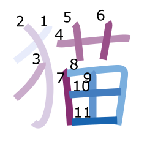

# anki-kanji
Make kanji stroke diagrams in Anki.

## Anki volgorde

じゅくご = schrijf kana
熟語 = schrijf kanji

## Usage
Install Anki with the [AnkiConnect](https://ankiweb.net/shared/info/2055492159) add-on, and InkScape for SVG rasterizing. SQLite is also required.

    $ brew cask install anki inkscape

Then run with

    $ node anki.js -h

.

## Distinct colors
https://sashat.me/2017/01/11/list-of-20-simple-distinct-colors/
https://en.wikipedia.org/wiki/Help:Distinguishable_colors

## Nederlands

Mnemonics voor lange *klinkers*, want die rijmen. 

do -> dop
to -> top
dou -> doos
tsuu
ju
yu
you -> jouw
jou -> joure