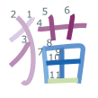

# anki-kanji
Make kanji stroke diagrams in Anki.

## Usage
Install Anki with the [AnkiConnect](https://ankiweb.net/shared/info/2055492159) add-on, and InkScape for SVG rasterizing. SQLite is also required.

    $ brew cask install anki inkscape
    
Then run with

    $ sh makeanki.sh 猫
    
To output `tmp/anki.styled.png` with

.
